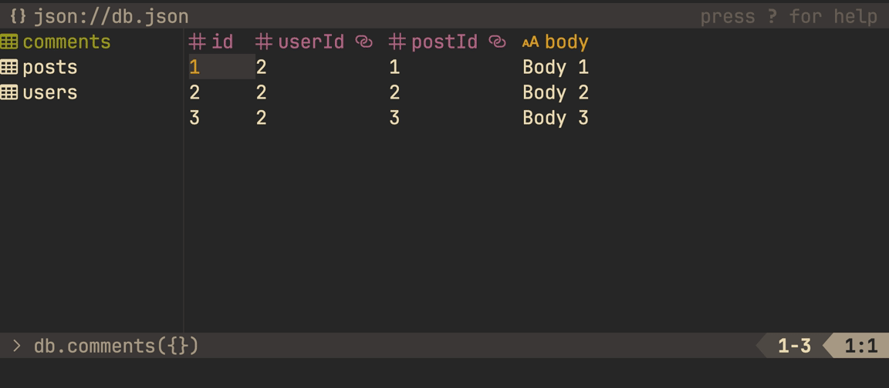

# mngr 2

**mngr** (databases **m**a**n**a**g**e**r**) is a command-line cross-platform databases management TUI tool

- Easy to use
- Works with your `$EDITOR`
- Has vim-like keybindings



- Built with [react-curse](https://github.com/infely/react-curse). Created for vim, tmux lovers :heart:

## Supported databases

- mongodb
- mysql/mariadb
- postgres
- sqlite
- json ([json-server](https://github.com/typicode/json-server) compatible)

## Try

```bash
npx mngr
```

## Installation

```bash
npm i -g mngr
```

## Usage

```bash
mngr
```

## Note

mngr 1.0.8 (built with blessed) is deprecated but available for installation `npm i -g mngr@1.0.8`
